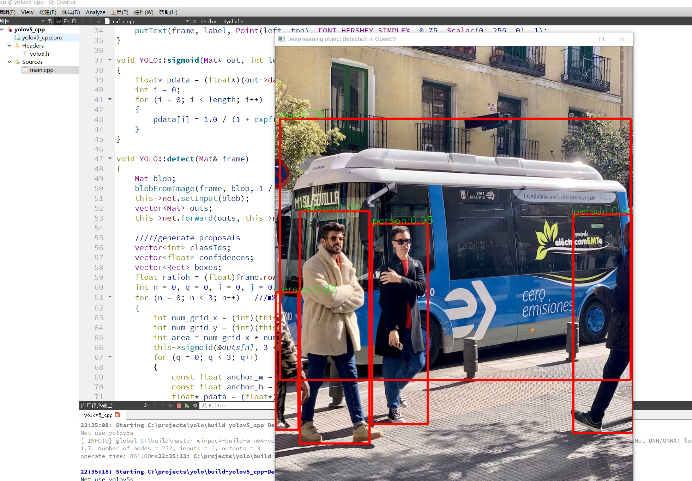

# yolov5_Qt
qt使用yolov5（V4.0），仅仅依赖opencv4


# onnx获取
①按照官方教程训练pt
②yolov5 压缩包readme导出onnx
```
python models/export.py --weights yolov5s.pt --img 640 --batch 1
```
```
python opencv_dnn_infer.py --imgpath data/images/bus.jpg
```

#qt使用
①打开qt_projects
②将上面的onnx放大编译后的文件夹，再放入几个图片
③修改cpp里面图片名字，运行。


## 结果

